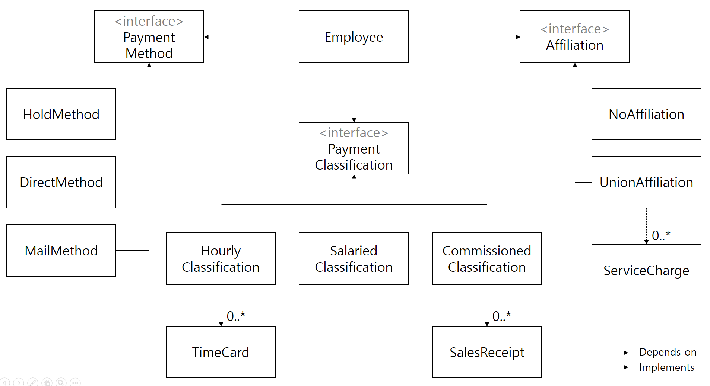

## 급여 관리 사례 연구

18장과 19장에서는 간단한 일괄 임금 지불 시스템을 설계하고 구현하는 과정을 소개한다. 이번 장에서는 그 개발 과정의 맨 첫 번째 반복을 보여줄 것이다.

### 명세

다음은 첫 반복에 선택된 사용자 스토리에 관해 고객과 나눈 대화에서 메모한 사항 중 일부이다.

- 몇몇 직원은 시간제로 일한다. 이들은 그들의 지구언 레코드의 한 필드인 시급으로 임금을 받는다. 이들은 매일 날짜와 일한 시간을 기록한 타임카드를 제출하고, 하루에 8시간 이상 일하면 초과 근무 시간에 대해서는 1.5배 임금을 받는다. 매주 금요일마다 임금을 받는다.
- 몇몇 직원은 고정된 월급을 받는다. 이들은 그 달의 마지막 평일에 임금을 받는다. 월급 액수는 그들의 직원 레코드의 한 필드가 된다.
- 월급을 받는 직원 중 일부는 별도로 판매량에 기반을 둔 커미션을 받는다. 이들은 날짜와 판매량이 기록된 판매 영수증을 제출한다. 커미션 비율은 이들의 직원 레코드의 한 필드가 된다. 이들은 격주로 금요일마다 임금을 받는다.
- 직원들은 임금을 받는 방법을 선택할 수 있다. 자신이 선택한 우편 주소로 지불 수표를 우송받을 수도 있고, 경리부장에게 맡겨 놓았다가 찾아갈 수도 있고, 자신이 선택한 은행 계좌로 직접 입금되도록 할 수 있다.
- 몇몇 직원은 조합에 속해있다. 이들의 직원 레코드는 주당 조합비 비율을 나타내는 필드를 가진다. 이 조합비는 임금에서 공제되어야 한다. 또한, 조합은 가끔 조합원 개인에게 서비스 요금을 부과할 수도 있다. 이 서비스 요금은 주 단위로 조합에 의해 제출되며, 해다하는 직원의 다음 달임금에서 공제되어야 한다.
- 임금 지불 애플리케이션은 각 평일에 한 번씩 실행되고 해당하는 직원에게 그 날 임금을 지불한다. 이 시스템은 직원이 임금을 받을 날짜를 입력받아, 지정된 날짜 전 마지막으로 임금을 받은 날부터 지정된 날짜까지의 임금을 계산한다.

### 데이트베이스에 관하여

보통 어플리케이션을 개발할 때 데이터베이스에 관련된 사항(어떤 데이터베이스를 사용할 것인지, 테이블 스키마는 어떻게 될 것인지 등)을 언제 결정해야 할까? 이 책의 필자는 데이터베이스를 도메인 로직과 관련 없는 **구체적인 사항**이라고 보고, 데이터베이스와 관련한 결정을 나중에 하기를 추천한다. 

> 나도 항상 프로젝트를 할 때 디비는 무엇을 쓰면 좋을지 결정한 뒤에 개발을 하는 편이었다. 특히 spring JPA를 이용해 개발을 할 때면 디비와 관련된 것들이 코드 레벨에 깊숙히 침투하기 때문에 개발을 할 때 DB 관련 사항을 항상 같이 생각했던 것 같다. 본질적인 것에 보다 집중하기 위한 개발 프로세스에 대해 다시 한 번 생각해봐야겠다.

## 유스케이스 분석

> 1절에서 소개한 사용자 스토리라는 개념이 유스케이스와 상당히 비슷하다고 느낀 적이 있다. 이 부분에서도 유스케이스라는 단어를 처음 사용하며 사용자 스토리와 매우 유사한 개념이라고 소개한다.

### 사용자 스토리

1. 새 직원을 추가한다.
2. 직원을 삭제한다.
3. 타임카드를 기록한다.
4. 판매 영수증을 기록한다.
5. 조합 서비스 요금을 기록한다.
6. 직원 정보를 변경한다.
7. 오늘 급여 프로그램을 실행한다.

위 사용자 스토리를 좀 더 상세화시켜 유스케이스로 만들어보자.

### 유스케이스 1. 직원 추가

새로운 직원은 AddEmp 트랜잭션을 받는 것에 의해 추가된다. 이 트랜잭션은 직원의 이름, 주소, 그리고 직원번호를 포함한다. 이것은 다음과 같은 세 형식을 가진다.

```
AddEmp <직원번호> "<이름>" "<주소>" H <시급>
AddEmp <직원번호> "<이름>" "<주소>" S <월급>
AddEmp <직원번호> "<이름>" "<주소>" C <월급> <커미션 비율>
```

이 유스케이스는 추상화를 암시한다. AddEmployee 트랜잭션은 큭 세 가지의 형식이 있지만 모두 직원번호, 이름, 주소 필드를 공통적으로 가진다. COMMAND 패턴을 사용해서 세 개의 파생 클래스를 가지는 AddEmployeeTransaction 클래스를 만들 수 있을 것이다.


COMMAND 패턴을 이용한 책임의 분리는 SRP를 멋지게 지키도록 할 수 있다. 그리고 이 유스케이스에 대한 분석은 Employee 객체의 계층 구조에 대한 통찰을 제시해주기도 한다. AddEmployee 트랜잭션은 필연적으로 Employee 객체와 강하게 결합되어 있기 때문에, 계층 구조 또한 상당히 비슷하게 될 것이다.

### 유스케이스 2. 직원 삭제

DelEmp 트랜잭션을 받으면 직원을 삭제한다. 이 트랜잭션의 형식은 다음과 같다.

```
DelEmp <직원번호>
```

이 트랜잭션을 받으면 해당하는 직원 레코드가 삭제된다.

이 유스케이스는 설계에 관해 아무런 영감도 주지 않는다. 패스 !

### 유스케이스 3. 타임카드 기록

TimeCard 트랜잭션을 받으면 시스템은 타임카드 레코드를 하나 생성하고 이것을 해당하는 직원 레코드에 연결시킨다.

```
TimeCard <직원번호> <날짜> <시간>
```

이 유스케이스를 분석하면서 얻을 수 있는 통찰은 '어떤 트랜잭션은 특정한 부류의 직원에 대해서만 쓸 수 있다'는 것이다. 이는 서로 다른 부류의 직원은 서로 다른 클래스로 표현되어야 한다는 것을 강조한다. 또한 이 유스케이스는 타임카드와 시간제 직원 사이의 관계를 암시한다.


### 유스케이스 4. 판매 영수증 기록하기

SalesReceipt 트랜잭션을 받으면, 시스템은 새로운 판매 영수증 레코드를 하나 생성하고, 이것을 해당하는 직원에 연결시킨다.

```
SalesReceipt <직원번호> <날짜> <액수>
```

유스케이스 4는 유스케이스 3과 매우 유사한 영감을 준다. CommisionedEmployee와 SalesReceipt 사이의 관계는 HourlyEmployee와 TimeCard 사이의 관계와 같다.

### 유스케이스 5. 조합 서비스 요금 기록하기

이 트랜잭션을 받으면 시스템은 서비스 요금 레코드 하나를 생성하고 이것을 해당하는 조합원 레코드에 연결시킨다.

```
ServiceCharge <memberID> <액수>
```

이 유스케이스는 직원번호에 의해 조합원에 접근하는 것이 아니라, 조합원들의 고유 번호를 통해 접근해야 함을 보여준다. 그리고 조합원 고유 번호의 존재는 곧 조합원과 직원을 연결시키는 체계가 시스템에 존재해야 함을 내포한다.

조합원(UnionMember) 객체와 ServiceCharge 객체의 관계는 역시 one to many 관계이다.

### 유스케이스 6. 직원 정보 변경

이 트랜잭션을 받으면 시스템은 해당하는 직원 레코드의 정보 중 하나를 변경한다. 이 트랜잭션에는 다양한 변형이 있을 수 있다.

```
ChgEmp <직원번호> Name <이름>
ChgEmp <직원번호> Address <주소>
ChgEmp <직원번호> Hourly <시급>
ChgEmp <직원번호> Salaried <월급>
ChgEmp <직원번호> Commissioned <월급> <비율>
ChgEmp <직원번호> Hold
ChgEmp <직원번호> Direct <은행> <계좌>
ChgEmp <직원번호> Mail <주소>
ChgEmp <직원번호> Member <조합원번호> Dues <조합원비 비율>
ChgEmp <직원번호> NoMember
```

이 유스케이스는 설계 측면에서 가지는 의미가 매우 크다.
 
앞서 유스케이스 1을 분석할 때 Employee 객체는 AddEmployeeTransaction 객체와 유사한 계층 구조를 가지게 될 것이라고 추측했었는데, 직원의 Payment Classification을 변경할 수 있다는 것은ㅇ 우리의 추측이 틀렸다는 것을 알려준다. 오히려 PaymentClassification을 기반 클래스로 하는 STRATEGY 패턴을 활용하는 것이 바람직해보인다.

지불 방법에 관해서도 STRATEGY 패턴을 적용할 수 있음을 쉽게 알 수 있다. PaymentMethod 기반클래스를 만들고, 이를 상속하는 HoldMethod(경리부장에게 맡겨놓기), DirectMethod(은행 계좌로 입금받기), MailMethod(우편으로 우송받기) 등의 파생클래스를 만들 수 있다.

조합원과 관련해서는 NULL OBJECT 패턴을 적용할 수 있다. 기술적으로는 Affiliation(조합) 클래스의 인스턴스이지만, 개념적으로는 아무일도 하지 않는 NoAffilication 변수를 static하게 선언한다.



이 구조는 급여 관리 애플리케이션의 핵심 모델이 된다. (물론 고정되지 않고 진화해 나가겠지만)

### 유스케이스 7. 임금지불일

Payday 트랜잭션을 받으면 시스템은 지정된 날짜에 임금을 받아야 할 직원을 모두 가려낸다. 그리고 이들이 얼마의 액수를 받아야 하는지 결정하고, 이들이 선택한 지불 방식으로 임금을 지불한다.

```
Payday <날짜>
```

동작 자체를 이해하는 것은 어렵지 않지만, 이 트랜잭션을 위의 핵심 모델에 어떻게 끼워넣을 수 있을까? 현재로서는 직원에 대한 임금을 계산하는 로직은 PaymentClassification에 있는 것이 가장 적절해보인다. PaymentClassification을 상속하는 각각의 클래스들은 임금 계산에 필요한 변수들을 모두 가지고 있기 때문이다.

### 무엇을 배웠는가

유스케이스를 분석하면서 배울 수 있었던 것은 시스템을 설계하는 데 필요한 풍부한 정보와 영감을 얻었다는 것이다. 우리는 시스템이 꼭 갖추어야 하는 동작에 대해 분석하면서 시스템을 어떻게 만들어나갈지에 대한 힌트를 얻을 수 있다.

## 잠재적인 추상화를 찾아서

누누이 강조했듯이 도메인 영역에 잠재하는 추상화를 찾는 문제는 매우 중요하다. 그리고 이미 우리는 위에서 유스케이스 분석을 통해 잠재적인 추상화를 몇 가지 찾아낼 수 있었다. 예를 들어 STRATEGY 패턴을 활용하는 PaymentClassification 클래스는 "모든 직원은 임금을 받는다."라는 잠재적인 추상화를 멋지게 표현하고 있다. 지금부터 우리는 유스케이스 분석에서 미처 다 드러내지 못한 더 은밀한 추상화를 찾아나서야 한다.

### 스케줄 추상화

SalariedEmployee는 매월 마지막 평일에 임금을 받고, CommissionedEmployee는 격주로 금요일마다 임금을 받으며, HourlyEmployee는 매주 금요일마다 임금을 받는다. 여기서 이끌어낼 수 있는 추상화는 스케줄(Schedule)이다.

위에서 진행한 유스케이스 분석에서 이 임금지급 스케줄은 굉장히 암시적으로만 표현되어있다. 다시말해 임금 지급 스케줄을 직원의 분류에 종속되어 있는 것으로 생각하고 있다. **하지만 우리는 이러한 직원분류와 스케줄 간의 연계가 본질적인 것인지를 생각해보아야 한다.** 갑자기 요구사항이 바뀌어서 같은 분류의 직원인데도 임금 지급 스케줄이 달라질 가능성을 배제할 수 없다면, 암시적으로 표현되어 있는 스케줄의 개념을 명시적으로 드러낼 필요가 있다.

> DDD 9장 '암시적인 개념을 명확하게' 부분과 비슷한 내용이다.

기술적인 관점에서 얘기를 하자면, 임금 스케줄 관련 작업을 지금처럼 PaymentClassification 객체에게 모두 위임한다면 이 객체는 스케줄 변경에 대해 닫혀 있을 수 없게 된다. 이는 곧 OCP의 위반을 의미한다.

그러므로 스케줄 추상화를 위해 다시 한 번 STRATEGY 패턴을 적용한다. Employee 객체는 멤버 변수로 itsSchedule을 가지고, 이는 PaymentSchedule 기반 클래스 타입을 가진다.

### 소소단체

요구사항은 직원이 조합에 가입되어 있을 수 있다고 말하고 있다. 하지만 조합이 아닌 다른 소소단체들이 존재할 가능성도 있고, 한 직원이 여러 단체에 동시에 소속되어 있을 수도 있다. 이러한 추상화를 표현하는 핵심 모델 내 개념은 Affiliation(소소단체)이다. 그리고 다수의 단체에 소속된 경우를 고려해 itsAffiliations 멤버변수의 타입을 Affiliation의 컬렉션으로 설정한다면 NULL OBJECT 패턴을 사용할 필요도 없게 된다. 가입된 소소단체가 없다면 그냥 빈 컬렉션을 갖게 될 것이다.

## 결론

여기서 명심해야 할 것은 UML 다이어그램이 곧 도메인 모델은 아니라는 것이다. 프로젝트의 첫 반복 주기에서 진행하는 유스케이스 분석의 목표는 확실한 설계를 만들어내는 것이 아니다. 팀원들이 사고 과정을 시작하고 일을 시작해나갈 공통적인 사고 모델을 확립하는 것으로 충분하다.