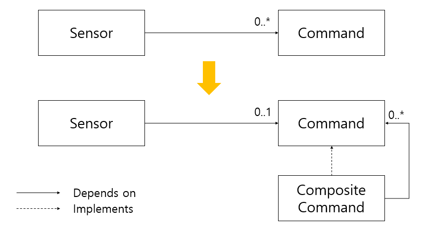

## COMPOSITE 패턴

동일하게 취급 받는 파생 클래스가 여러개 있을 때, 이 여러 파생 클래스를 멤버 변수로 두고, 똑같은 기반 클래스를 상속하는 COMPOSITE 클래스를 만들 수 있다. 이 패턴의 사용은 단순하지만 가져올 수 있는 이득은 크다.

### 예제 : Sensor <-> Command

앞서 COMMAND 패턴에 대해 소개하면서 Sensor와 Command 객체에 관련된 예제를 소개한 적이 있다. 여기서 Sensor의 역할은 적절한 Command 객체의 do 함수를 순차적으로 호출하는 것 뿐이었다. Command 기반 클래스를 상속하는 Composite Command 클래스를 생성하기에 적절한 경우이다.

위 예시에서 COMPOSITE 패턴을 적용했을 때, Sensor 객체는 자신이 COMPOSITE 객체를 사용하고 있다는 사실조차 알지 못한다. COMPOSITE 패턴을 사용하면서 얻을 수 있는 이점은 두 객체 간의 관계를 일대다에서 일대일 관계로 바꿀 수 있다는 것이다. 분명 일대다 관계보다는 일대일 관계가 이해하고 유지보수하기가 쉬우므로, 이는 분명한 설계상의 이점을 가져다준다.

### COMPOSITE 패턴을 사용할 수 있는 경우

모든 파생 클래스 그룹에 대해 COMPOSITE 패턴을 적용할 수 있는 것은 아니다. 위 예시를 보면 알 수 있겠지만, 모든 파생 클래스가 그것의 사용자에 의해 똑같이 취급받을 때에만 올바른 COMPOSITE 패턴을 적용할 수 있다. 우리의 목표는 기존의 객체들을 변경하지 않고 기능을 확장할 수 있어야 하므로, 올바르지 않은 COMPOSITE 패턴의 사용은 OCP를 위반하는 결과를 낳을 수도 있다.