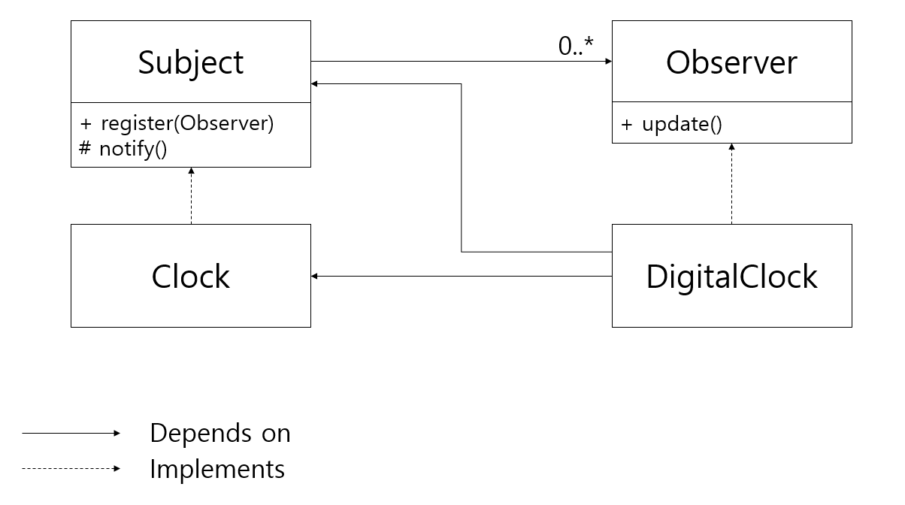

## OBSERVER 패턴

OBSERVER 패턴은 객체의 상태 변화를 관찰하는 관찰자들, 즉 옵저버들의 목록을 객체에 등록하여 상태 변화가 있을 때마다 메서드 등을 통해 객체가 직접 목록의 각 옵저버에게 통지하도록 하는 디자인 패턴이다.

### 예시 : 디지털 시계 만들기

디지털 시계 구현을 예시로 OBSERVER 패턴을 알아보자. 디지털 시계는 시스템의 시각에 대한 정보를 모두 알고 있는 Clock 객체로부터 주기적으로 정보를 받아 화면에 현재 시각을 표시해주어야 한다. 이처럼 OBSERVER 패턴은 주기적인 상태 변화를 다른 객체에 알려주어야 할 때 사용하기에 적절하다.

OBSERVER 패턴의 핵심은 Subject(피관찰자)과 Observer(관찰자) 클래스이다. Subject에서는 register 메소드를 통해 Observer 클래스를 등록할 수 있고, notify 메소드를 통해 자신의 변경에 대한 사실을 등록된 Observer 들에게 알릴 수 있다. notify 메소드에서는 각 Observer들의 update 메소드를 호출해 Observer들이 Subject의 변경 사항에 대응할 수 있도록 한다.

### Push Model vs Pull Model

OBSERVER 패턴을 사용하는 방식은 크게 두 가지가 있다. Subject의 변경사항을 전달하는 주체가 누구냐에 따라 나뉘는데, Pull model은 observer가 변화에 반응하기 위해 직접 subject에서 정보를 당겨온다. 반면 Push model에서는 Subject가 notify에서 Observer의 update 메소드를 호출할 때, 자신의 변경 사항을 parameter로 실어준다.

이 두 방식 중 어느 것을 선택할 지는 Subject의 복잡도에 관한 문제이다. Subject가 복잡해서 Observer가 단서를 받아야 한다면 push model이 적절할 것이고, 그게 아니라면 Observer가 데이터를 직접 끌어오는 것으로 충분할 것이다.

### OBSERVER 패턴의 이점

OBSERVER 패턴을 사용하면 여러 설계 원칙을 잘 지킬 수 있다.

첫째로 기존 객체를 변경하지 않고도 Subject를 구독하는 Observer를 마음껏 추가할 수 있으므로 OCP를 잘 지킬 수 있도록 해준다.

둘째로는 Subject가 구체적인 클래스에 의존하지 않고 Observer라는 인터페이스에 의존하도록 함으로써 DIP도 잘 지키고 있다.

그리고 OBSERVER 패턴을 사용하면 Observer가 Subject의 변경 사항을 주기적으로 polling할 필요 없이 Subject의 변화가 있을 때만 그 변화에 반응하면 되기 때문에 보다 효율적으로 작동할 수 있다.

> OBSERVER 패턴에 대해 읽으면서 최근에 관심을 두고 있었던 Reactive Programming 패러다임이 많이 생각났다. 특히 Observer/Observable 등의 개념을 사용하는 Reactive X의 경우 이 observer 패턴에 개념적 기반을 두고 있다는 것을 알게 되었다.