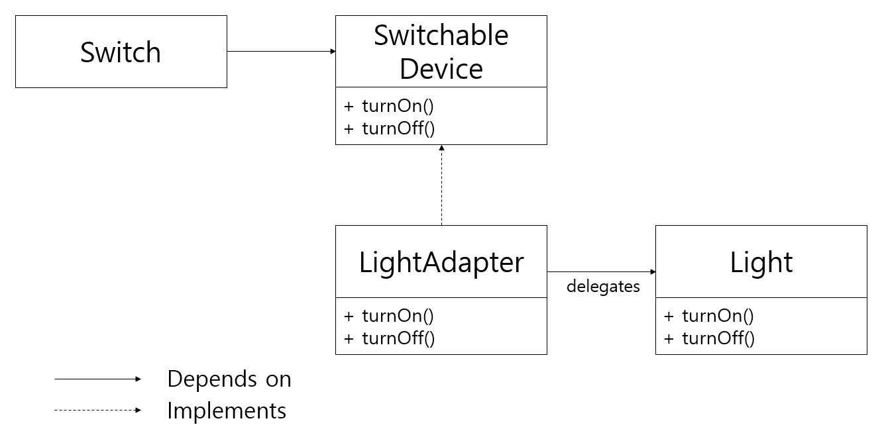
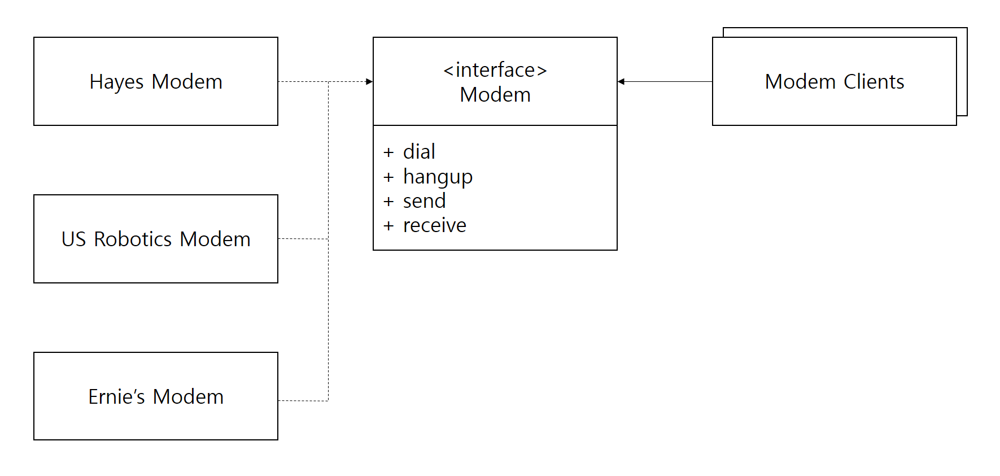

## ABSTRACT SERVER 패턴

ABSTRACT SERVER 패턴은 디자인 패턴 가운데 가장 단순한 패턴으로, DIP를 지키기 위해 가장 첫 번째로 적용해볼 수 있는 방법이다. 이전의 숱한 예시에서도 익숙하게 사용해 왔던 방식인데, 상위 모듈이 구체적인 하위 모듈에 의존하도록 하지 않고 사이에 인터페이스를 하나 두어 추상화에 의존하도록 하는 것이다.

### 인터페이스의 소유자

DIP에서도 설명했듯이, ABSTRACT SERVER는 보통 이를 구현하는 클래스와 함께 묶이기 보다는 이를 사용하는 클라이언트와 함께 묶이는 경향을 보인다. 즉 클라이언트가 인터페이스를 소유할 가능성이 높다.

이러한 경향은 효율적인 패키지 관리 전략 설정에 중요한 도움을 줄 수도 있다. 

## ADAPTER 패턴

위 구조의 한 가지 문제점은, Lamp 객체가 SwitchableDevice 인터페이스와 강력하게 결합된다는 것이다. Switch로 제어하고 싶은 Light 객체가 있는데, 이 객체는 서드파티에서 사온 것이라 SwtichableDevice에서 파생될 수 없다고 해보자. 이런 경우에 ADAPTER 패턴을 적용하기에 적절하다.

Switch로 제어하고 싶은 구체적인 클래스가 SwitchableDevice를 직접 구현하도록 하지 않고, 중간에 LightAdapter 객체를 하나 두어 이 객체가 SwitchableDevice를 구현하도록 한다. 그리고 실제 동작은 구체적인 클래스(Light, Lamp 등)에게 모두 위임한다.

### ADAPTER 패턴의 효용

ADAPTER 패턴은 문제를 멋지게 해결하지만, 꽤 많은 비용을 수반한다. 대부분의 경우는 ABSTRACT SERVER만으로 충분할 것이다.

### 예시 : 모뎀 문제

다음의 상황을 한번 살펴보자. 아래와 같은 구조는 굉장히 흔히 볼 수 있는 구조이며, OCP와 LSP, DIP 등이 멋지게 지켜지고 있는 것으로 보인다.

#### 새로운 요구사항

고객으로부터 건네받은 새로운 요구사항은 전화 다이얼을 걸지 않는 전용모뎀(dedicated modem)을 추가해달라는 것이었다. 이 전용 모뎀을 사용하는 클라이언트들은 다이얼을 돌릴 필요가 없는, 기존의 클라이언트와는 다르게 작동하는 어플리케이션이 생기게 되는데, 이를 DedUsers라고 부르겠다.
 
하지만 우리 고객은 지금 있는 모뎀 클라이언트들도 모두 전용 회선을 쓸 수 있게 되기를 바란다. 고객은 모뎀 클라이언트 애플리케이션 몇 백 개를 고치고 싶지는 않으니, 이 모뎀 클라이언트들이 그냥 가짜 전화번호를 돌릴 수 있도록 해주었으면 좋겠다고 한다.

### 이상적인 해결책

이상적인 해결책은 ISP를 활용하는 것이다. Modem 객체를 구현하지만 Modem 객체에 있는 dial과 hangup 메소드를 사용하지 않는 새로운 클라이언트가 생길 것이기 때문에 Modem 인터페이스를 두 개로 분리하고, DedicatedModem은 둘 중 하나의 인터페이스만 구현하도록 한다.

하지만 이렇게 하려면 현재 있는 모뎀 클라이언트들을 모두 수정해야 하는데, 고객이 그걸 원하지 않기 때문에 다른 방법을 찾아야한다.

Modem 인터페이스는 그대로 두되, Dedicated Modem은 dial과 hangup을 의미없는 함수로 만드는 건 어떨까? 이 방법도 나름대로 동작은 하겠지만 **퇴화된 함수는 LSP를 위반하게 될 지도 모른다는 신호이다.** 

### 임시방편으로 문제 해결하기

우리는 DedUsers를 만드는 사람들이 굉장히 싫어할 만한 해결책을 가지고 있다. 바로 DedicatedModem도 기존 모뎀의 연결 상태를 흉내낼 수 있도록 dial과 hangup 함수를 작성하고, DedUsers에게 DedicatedModem을 쓸 때도 dial과 hangup 함수를 호출해야 한다고 일러두는 것이다. 

### 임시방편의 문제

임시방편으로 생각한 해결책의 문제는 DedUsers가 도메인 영역에서 아무 쓸모도 없는 dial과 hangup의 동작에 대해 계속 신경을 써야한다는 것이다. 예를 들어 dial의 파라미터로 들어갈 전화번호의 길이가 바뀌었다고 하면, DedUsers는 자신들과는 아무런 상관이 없는 전화번호 때문에 불필요한 변경을 감수해야 한다. 

### ADAPTER를 이용한 해결

DedicatedModem이 기존 모뎀의 동작을 흉내내도록 한다는 임시방편의 해결책은 유지하되, 변경의 파장이 DedUsers에게까지 전달되지 않도록 ADAPTER 패턴을 적용할 수 있다.

dial과 hangup 동작의 모사는 Adapter에서 일어나고, adapter는 dedicated Modem에게 꼭 필요한 send와 receive에 대한 동작만 위임한다. 이렇게 하면 DedUsers는 아무런 문제없이 전용 모뎀을 사용할 수 있게 된다.