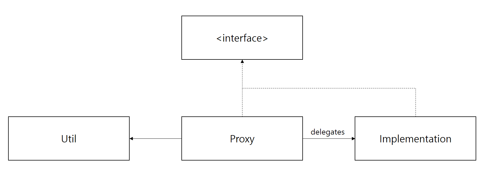

소프트웨어 시스템에는 많은 경계와 장벽이 있다. 프로그램에서 데이터베이스로 데이터를 옮기는 것은 데이터베이스의 장벽을 넘는 것이며, 한 컴퓨터에서 다른 컴퓨터로 메시지를 전송하는 것은 네트워크의 장벽을 넘는 것이다.

PROXY 패턴은 우리가 집중하려는 핵심 비즈니스 로직이 이러한 장벽을 넘는 문제로 오염되지 않도록 도와줄 수 있다.

## PROXY

PROXY 패턴을 이용하는 모델은 보통 아래와 같은 모양새를 가진다.



Proxy 객체는 장벽 너머의 세부사항을 모두 알고 있는 Util (DB, API, etc...) 객체를 사용하여 장벽 안과 밖을 이어주는 역할을 하고, 핵심 비즈니스 로직에 대한 수행 권한은 모두 자신과 같은 인터페이스를 구현하는 Implementation 객체에 위임한다.

Proxy 객체가 동작 수행에 필요한 값들을 모두 갖고 있고, 이렇다할 비즈니스 로직이랄게 없는 경우는 아래처럼 Implementation 객체에 권한을 위임하지 않을 수도 있고 구조를 단순하게 유지할 수도 있다. 

(쇼핑 카트 예제)

```java
public class ProductProxy implements Product {
    private String itsSku;
    public ProductProxy(String sku) {
        itsSku = sku;
    }
    
    public int getPrice() throws Exception {
        ProductData pd = DB.getProductData(itsSku);
        return pd.price;
    }

    public int getName() throws Exception {
        ProductData pd = DB.getProductData(itsSku);
        return pd.name;
    }
}
```

하지만 동작을 수행하는 과정에서 유의미한 비즈니스 로직이 존재한다면, 이에 대한 수행 권한은 모두 Implementation 객체에게 위임해야 한다. 아래 total 메소드가 그러한 방식으로 작성되어있다.

```java
public class OrderProxy implements Order {
    private int orderId;
    public OrderProxy(int orderId) {
        this.orderId = orderId;
    }
    
    public int total() {
        try {
            OrderImp imp = new OrderImp(getCustomerId());
            ItemData[] itemDataArray = DB.getItemsForOrder(orderId);
            
            for (ItemData item : itemDataArray) {
                imp.addItem(new ProductProxy(item.sku), item.qty);    
            }

            return imp.total();
        } catch (Exception e) {
            throw new Error(e.toString());
        }
    }

    (후략)
}
```

### PROXY 패턴의 이점

PROXY 패턴의 이점은 **관심사의 분리**이다. 우리가 애플리케이션을 개발하면서 집중하고자 하는 곳은 비즈니스 로직이다. 하지만 서드파티 라이브러리나 외부 API 등의 장벽 너머의 도구들을 사용하면서 우리는 비즈니스 로직에 집중하기보다는 장벽 너머의 도구 자체에 압도되곤 한다. PROXY 패턴은 장벽 너머의 것과 우리 애플리케이션을 멋지게 연결하면서도 비즈니스 규칙을 확실하게 분리할 수 있다.

하지만 위에서 살펴봤듯이 PROXY 패턴은 적용하기가 생각보다 까다롭다. 맨 처음 봤던 이미지와 같은 표준적인 프록시 모델은 엄격히 유지하기가 힘든 경우가 많고, 비즈니스 로직을 확실히 분리하기 위해서는 더욱 많은 양의 코드를 작성해야 할 때도 있다. 그렇기 때문에 PROXY 패턴과 같은 무거운 솔루션을 사용하고자 한다면 적절한 상황에서 사용하려는 신중한 고민이 필요하다. 가령 PROXY 패턴은 데이터베이스 스키마 혹은 외부 API 명세 등이 자주 바뀌는 아주 커다란 시스템에서 사용했을 때 이득을 볼 수 있다.