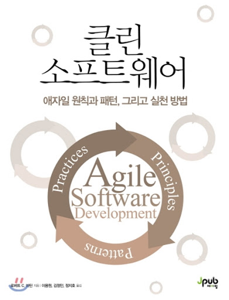

# Book-Agile-Software-development

책 "소프트웨어 개발의 지혜: 원칙, 디자인 패턴, 실천방법 (로버트 C. 마틴)"의 내용을 요약하고 느낀점을 기록합니다.

* 2004년에 출간된 본 책은 **클린 소프트웨어**라는 이름으로 2017년에 복간되기도 했습니다.

- 1절_애자일 개발
  - 1장_애자일 실천방법
  - 2장_익스트림 프로그래밍 소개
  - 3장_계획 세우기
  - 4장_테스트
  - 5장_리팩토링
  - 6장_프로그래밍 에피소드
  
- 2절_애자일 설계
  - 7장_애자일 설계란 무엇인가
  - 8장_SRP: 단일 책임 원칙
  - 9장_OCP: 개방-폐쇄 원칙
  - 10장_LSP: 리스코프 치환 원칙
  - 11장_DIP: 의존 관계 역전 원칙
  - 12장_ISP: 인퍼테이스 분리 원칙
  
- 3절_급여 관리 사례 연구
  - 13장_COMMAND 및 ACTIVE OBJECT 패턴
  - 14장_TEMPLATE METHOD 및 STRATEGY 패턴: 상속과 위임
  - 15장_FACADE 및 MEDIATOR 패턴
  - 16장_SINGLETON 및 MONOSTATE 패턴 (~2020.03.24)
  - 17장_NULL OBJECT 패턴
  - 18장_급여 관리 사례 연구: 반복의 시작
  - 19장_급여 관리 사례 연구: 구현

- 4절_급여 관리 시스템 패키징
  - 20장_패키지 설계의 원칙
  - 21장_FACTORY 패턴
  - 22장_급여 관리 사례 연구 (~2020.03.29)

- 5절_기상 관측기 사례 연구
  - 23장_COMPOSITE 패턴
  - 24장_OBSERVER 패턴
  - 25장_ABSTRACT SERVER, ADAPTER, BRIDGE 패턴
  - 26장_PROXY와 STAIRWAY TO HEAVEN_서드파티 API 관리 (~2020.04.03)
